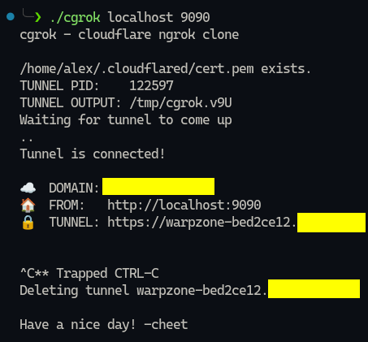
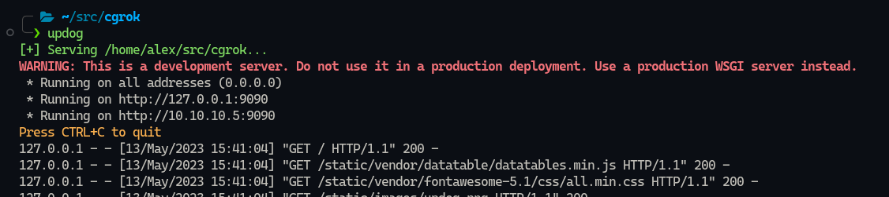

# cgrok

`cgrok` is a wrapper for `cloudflared` that makes it easier to use on the fly. Easily forward any webservice in 1 command.



Do you want to expose a webservice to the internet (over HTTPS), but you don't want to open any ports on your firewall/router? Do you have a Cloudflare account and a configured domain name?

`cgrok` enables you to forward your webservices to Cloudflare, for them to front on their servers. You only need "outgoing" internet connection to Cloudflare to make use of this, unlike a normal setup where you'd need your webservice to be able to reachable FROM Cloudflare.

Basically, if you set it up with `mydomain.com`, you can run `cgrok localhost 9090` and it'll make you a `warpzone-${RANDOMCRAP}.mydomain.com` url that is reachable from anywhere, with HTTPS provided by Cloudflare.

This is really useful to quickly get something up for a test or PoC, or maybe you need to show your buddy something you're deving locally, or maybe you're on a pentest and need to forward that damn internal iot device to your colleague.


## Installation

- Install `cloudflared` from your package manager or manually add it to your path
- Login to `cloudflared` by getting your private cert.pem and then add it to `~/.cloudflared/cert.pem`

```bash
cloudflared tunnel login
```

> See the [cloudflared docs](https://developers.cloudflare.com/cloudflare-one/connections/connect-apps/install-and-setup/tunnel-guide/local/) for more information 

## Usage
```
USAGE:
    cgrok [hostname] [port] [cert path]

EXAMPLES;
    cgrok localhost 9090
```

### Updog

The typical example uses `updog` as a test service that runs locally on port 9090 by default.

> See the [updog docs](https://github.com/sc0tfree/updog) for more information

```bash
pip install updog
mkdir www
cd www
updog
```


